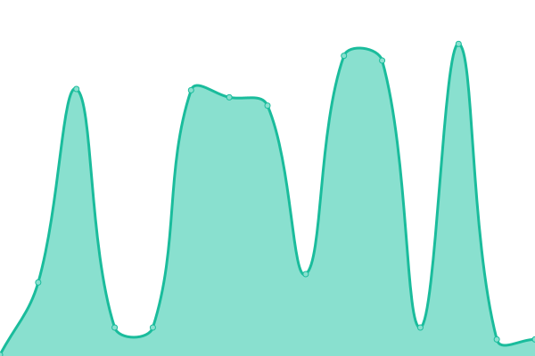

# [📈 Live Status](https://uptime.ikms.eu.org): <!--live status--> **🟧 Partial outage**

This repository contains the open-source uptime monitor and status page for [iougemini](https://uptime.ikms.eu.org), powered by [Upptime](https://github.com/upptime/upptime).

With [Upptime](https://upptime.js.org), you can get your own unlimited and free uptime monitor and status page, powered entirely by a GitHub repository. We use [Issues](https://github.com/iougemini/ikms-uptime/issues) as incident reports, [Actions](https://github.com/iougemini/ikms-uptime/actions) as uptime monitors, and [Pages](https://uptime.ikms.eu.org) for the status page.

<!--start: status pages-->
<!-- This summary is generated by Upptime (https://github.com/upptime/upptime) -->
<!-- Do not edit this manually, your changes will be overwritten -->
<!-- prettier-ignore -->
| URL | Status | History | Response Time | Uptime |
| --- | ------ | ------- | ------------- | ------ |
|  [主KMS激活服务器](s.ikms.eu.org) | 🟩 Up | [kms.yml](https://github.com/iougemini/ikms-uptime/commits/HEAD/history/kms.yml) | 

 190ms
     
 | 

<a href="https://uptime.ikms.eu.org/history/kms">0.18%</a>
    

|  [备用KMS激活服务器 01](s01.ikms.eu.org) | 🟥 Down | [kms-01.yml](https://github.com/iougemini/ikms-uptime/commits/HEAD/history/kms-01.yml) | 

 0ms
     
 | 

<a href="https://uptime.ikms.eu.org/history/kms-01">0.06%</a>
    

<!--end: status pages-->

[**Visit our status website →**](https://uptime.ikms.eu.org)

## 📄 License

- Powered by: [Upptime](https://github.com/upptime/upptime)
- Code: [MIT](./LICENSE) © [Anand Chowdhary](https://anandchowdhary.com), supported by [Pabio](https://pabio.com)
- Data in the `./history` directory: [Open Database License](https://opendatacommons.org/licenses/odbl/1-0/)
