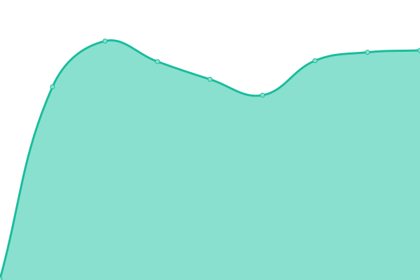
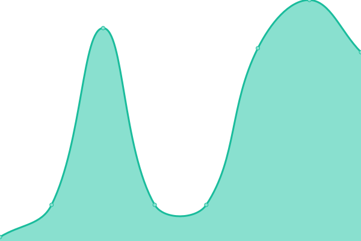
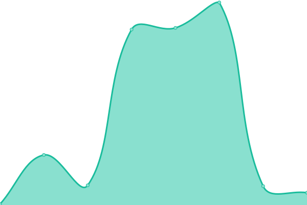

# [📈 Live Status](https://uptime.ikms.eu.org): <!--live status--> **🟧 Partial outage**

This repository contains the open-source uptime monitor and status page for [iougemini](https://uptime.ikms.eu.org), powered by [Upptime](https://github.com/upptime/upptime).

With [Upptime](https://upptime.js.org), you can get your own unlimited and free uptime monitor and status page, powered entirely by a GitHub repository. We use [Issues](https://github.com/iougemini/ikms-uptime/issues) as incident reports, [Actions](https://github.com/iougemini/ikms-uptime/actions) as uptime monitors, and [Pages](https://uptime.ikms.eu.org) for the status page.

<!--start: status pages-->
<!-- This summary is generated by Upptime (https://github.com/upptime/upptime) -->
<!-- Do not edit this manually, your changes will be overwritten -->
<!-- prettier-ignore -->
| URL | Status | History | Response Time | Uptime |
| --- | ------ | ------- | ------------- | ------ |
|  [主KMS激活服务器](s.ikms.eu.org) | 🟩 Up | [kms.yml](https://github.com/iougemini/ikms-uptime/commits/HEAD/history/kms.yml) | 

 176ms
     
 | 

<a href="https://uptime.ikms.eu.org/history/kms">100.00%</a>
    

|  [备用KMS激活服务器 01](s01.ikms.eu.org) | 🟥 Down | [kms-01.yml](https://github.com/iougemini/ikms-uptime/commits/HEAD/history/kms-01.yml) | 

 213ms
     
 | 

<a href="https://uptime.ikms.eu.org/history/kms-01">48.05%</a>
    

|  [备用KMS激活服务器 02](s02.ikms.eu.org) | 🟩 Up | [kms-02.yml](https://github.com/iougemini/ikms-uptime/commits/HEAD/history/kms-02.yml) | 

 219ms
     
 | 

<a href="https://uptime.ikms.eu.org/history/kms-02">100.00%</a>
    

|  [备用KMS激活服务器 03](s03.ikms.eu.org) | 🟩 Up | [kms-03.yml](https://github.com/iougemini/ikms-uptime/commits/HEAD/history/kms-03.yml) | 

 184ms
     
 | 

<a href="https://uptime.ikms.eu.org/history/kms-03">100.00%</a>
    

|  [备用KMS激活服务器 04](s04.ikms.eu.org) | 🟩 Up | [kms-04.yml](https://github.com/iougemini/ikms-uptime/commits/HEAD/history/kms-04.yml) | 

 216ms
     
 | 

<a href="https://uptime.ikms.eu.org/history/kms-04">100.00%</a>
    

|  [备用KMS激活服务器 05](s05.ikms.eu.org) | 🟩 Up | [kms-05.yml](https://github.com/iougemini/ikms-uptime/commits/HEAD/history/kms-05.yml) | 

 213ms
     
 | 

<a href="https://uptime.ikms.eu.org/history/kms-05">100.00%</a>
    

|  [备用KMS激活服务器 06](s06.ikms.eu.org) | 🟩 Up | [kms-06.yml](https://github.com/iougemini/ikms-uptime/commits/HEAD/history/kms-06.yml) | 

 40ms
     
 | 

<a href="https://uptime.ikms.eu.org/history/kms-06">19.98%</a>
    

|  [备用KMS激活服务器 07](s07.ikms.eu.org) | 🟩 Up | [kms-07.yml](https://github.com/iougemini/ikms-uptime/commits/HEAD/history/kms-07.yml) | 

 223ms
     
 | 

<a href="https://uptime.ikms.eu.org/history/kms-07">100.00%</a>
    

|  [备用KMS激活服务器 08](s08.ikms.eu.org) | 🟥 Down | [kms-08.yml](https://github.com/iougemini/ikms-uptime/commits/HEAD/history/kms-08.yml) | 

 0ms
     
 | 

<a href="https://uptime.ikms.eu.org/history/kms-08">0.00%</a>
    

|  [备用KMS激活服务器 09](s09.ikms.eu.org) | 🟩 Up | [kms-09.yml](https://github.com/iougemini/ikms-uptime/commits/HEAD/history/kms-09.yml) | 

 117ms
     
 | 

<a href="https://uptime.ikms.eu.org/history/kms-09">100.00%</a>
    

|  [备用KMS激活服务器 10](s10.ikms.eu.org) | 🟩 Up | [kms-10.yml](https://github.com/iougemini/ikms-uptime/commits/HEAD/history/kms-10.yml) | 

 184ms
     
 | 

<a href="https://uptime.ikms.eu.org/history/kms-10">100.00%</a>
    

|  [备用KMS激活服务器 11](s01.ikms.eu.org) | 🟩 Up | [kms-11.yml](https://github.com/iougemini/ikms-uptime/commits/HEAD/history/kms-11.yml) | 

 33ms
     
 | 

<a href="https://uptime.ikms.eu.org/history/kms-11">16.46%</a>
    

|  [备用KMS激活服务器 01](s11.ikms.eu.org) | 🟥 Down | [kms-01.yml](https://github.com/iougemini/ikms-uptime/commits/HEAD/history/kms-01.yml) | 

 213ms
     
 | 

<a href="https://uptime.ikms.eu.org/history/kms-01">48.03%</a>
    

|  [备用KMS激活服务器 12](s12.ikms.eu.org) | 🟩 Up | [kms-12.yml](https://github.com/iougemini/ikms-uptime/commits/HEAD/history/kms-12.yml) | 

 217ms
     
 | 

<a href="https://uptime.ikms.eu.org/history/kms-12">100.00%</a>
    

|  [备用KMS激活服务器 13](s13.ikms.eu.org) | 🟩 Up | [kms-13.yml](https://github.com/iougemini/ikms-uptime/commits/HEAD/history/kms-13.yml) | 

 202ms
     
 | 

<a href="https://uptime.ikms.eu.org/history/kms-13">100.00%</a>
    

<!--end: status pages-->

[**Visit our status website →**](https://uptime.ikms.eu.org)

## 📄 License

- Powered by: [Upptime](https://github.com/upptime/upptime)
- Code: [MIT](./LICENSE) © [Anand Chowdhary](https://anandchowdhary.com), supported by [Pabio](https://pabio.com)
- Data in the `./history` directory: [Open Database License](https://opendatacommons.org/licenses/odbl/1-0/)
